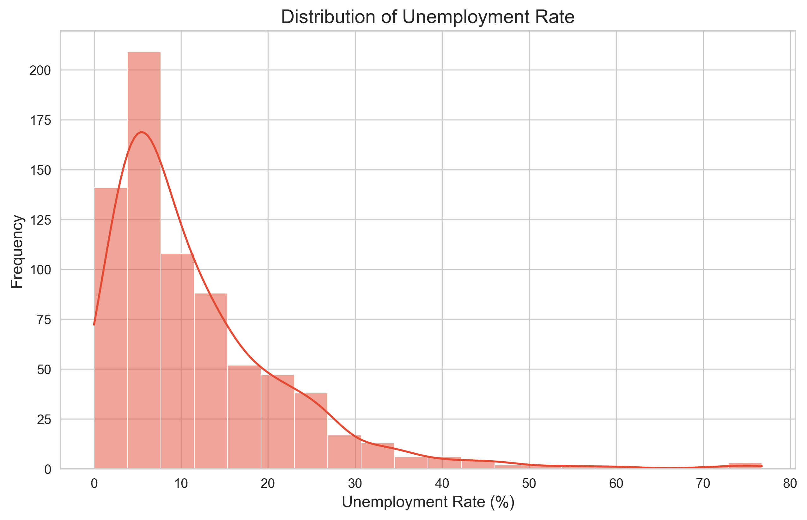
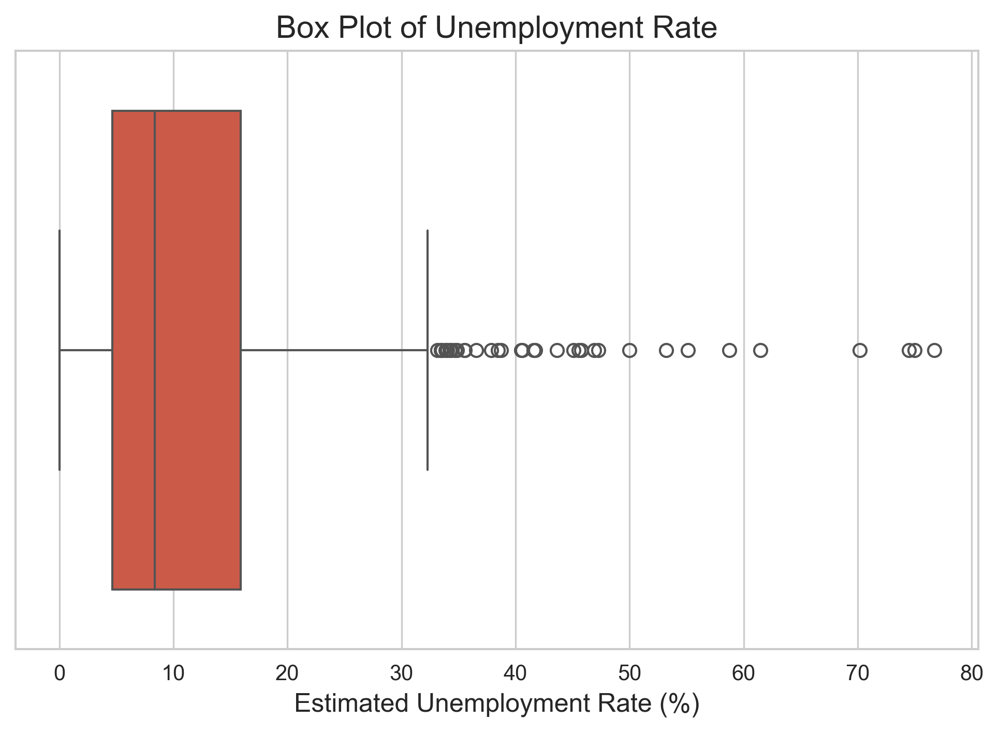
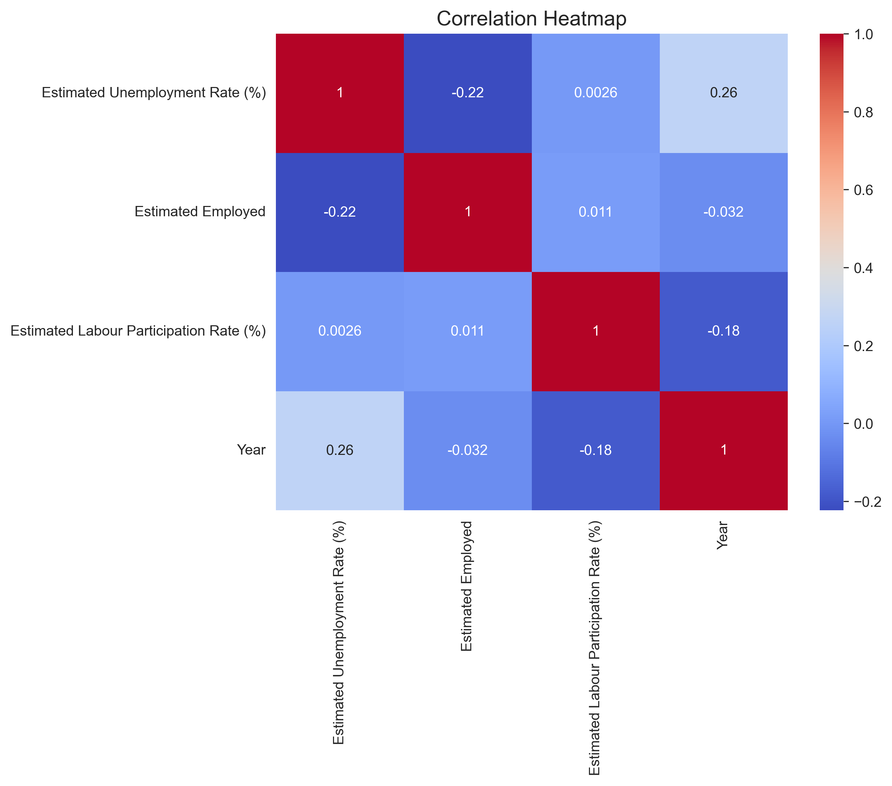
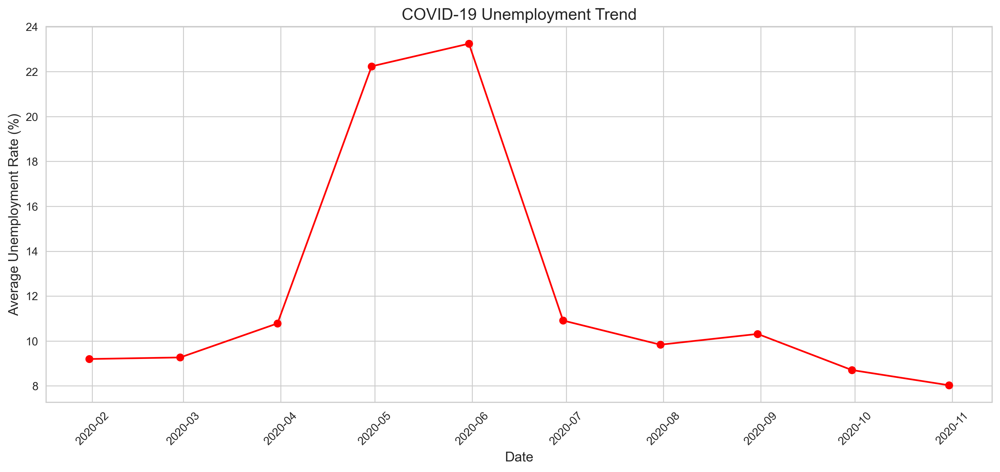

# 📊 Unemployment Analysis with Python

## 📌 Project Overview

This project analyzes unemployment trends in India using Python. It explores unemployment rates across different states, compares rural and urban areas, and studies the impact of the COVID-19 pandemic through data analysis and visualization.

The project demonstrates the complete Data Analysis workflow, including data cleaning, exploratory data analysis (EDA), visualization, and deriving meaningful insights from real-world datasets.

---

## 🎯 Objectives

- Analyze unemployment trends across India.
- Compare unemployment rates among different states.
- Study the impact of COVID-19 on unemployment.
- Compare rural and urban unemployment.
- Visualize unemployment patterns using different charts.
- Generate meaningful insights from the data.

---

## 📂 Dataset

This project uses two datasets:

1. **Unemployment in India.csv**
   - Historical unemployment data
   - State-wise unemployment information
   - Rural and Urban classification

2. **Unemployment_Rate_upto_11_2020.csv**
   - COVID-19 unemployment data
   - Region information
   - Latitude and Longitude for visualization

---

## 📁 Project Structure

```text
Unemployment-Analysis-Python/
│
├── data/
│   ├── Unemployment in India.csv
│   └── Unemployment_Rate_upto_11_2020.csv
│
├── notebooks/
│   └── Unemployment_Analysis.ipynb
│
├── images/
│   ├── histogram.png
│   ├── boxplot.png
│   ├── heatmap.png
│   ├── monthly_trend.png
│   ├── top10_states.png
│   ├── scatter_plot.png
│   ├── pie_chart.png
│   └── covid_trend.png
│
├── reports/
│   └── Project_Report.pdf
│
├── README.md
├── requirements.txt
└── .gitignore
```

---

## 🛠 Technologies Used

- Python
- Pandas
- NumPy
- Matplotlib
- Seaborn
- Plotly
- Jupyter Notebook

---

## 📊 Data Analysis Workflow

- Data Collection
- Data Loading
- Data Cleaning
- Missing Value Analysis
- Duplicate Removal
- Date Conversion
- Exploratory Data Analysis (EDA)
- Data Visualization
- COVID-19 Analysis
- Regional Analysis
- Insights & Conclusion

---

## 📈 Visualizations

The project includes the following visualizations:

- Histogram
- Box Plot
- Line Chart
- Bar Chart
- Pie Chart
- Scatter Plot
- Heatmap
- Pair Plot
- Monthly Trend Analysis
- Year-wise Analysis
- COVID-19 Trend Analysis
- Interactive India Map (Plotly)

---

## 📊 Key Insights

- Significant differences exist in unemployment rates across Indian states.
- COVID-19 caused a sharp increase in unemployment during 2020.
- Rural and Urban unemployment patterns differ considerably.
- Labour participation varies across regions.
- Employment trends changed significantly during the pandemic.

---

## 🚀 How to Run the Project

### 1. Clone the repository

```bash
git clone https://github.com/your-username/Unemployment-Analysis-Python.git
```

### 2. Open the project folder

```bash
cd Unemployment-Analysis-Python
```

### 3. Install dependencies

```bash
pip install -r requirements.txt
```

### 4. Launch Jupyter Notebook

```bash
jupyter notebook
```

### 5. Open

```
notebooks/Unemployment_Analysis.ipynb
```

Run all cells.

---

## 📸 Project Screenshots

### Histogram



---

### Box Plot



---

### Heatmap



---

### COVID-19 Trend



---

## 📚 Future Improvements

- Machine Learning model for unemployment prediction
- Time Series Forecasting
- Streamlit Web Application
- Power BI Dashboard
- Real-time data integration

---

## 📄 Project Report

A detailed project report is available in the **reports** folder.

---

## 👩‍💻 Author

**Aayushi kumari**

B.Tech (Computer Science Engineering - AI & ML)

---

## ⭐ If you found this project useful, please consider giving it a Star!